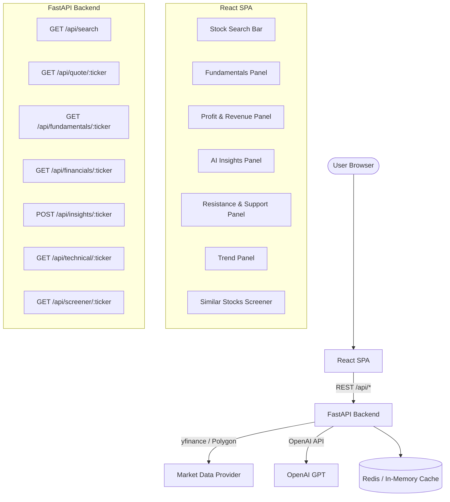
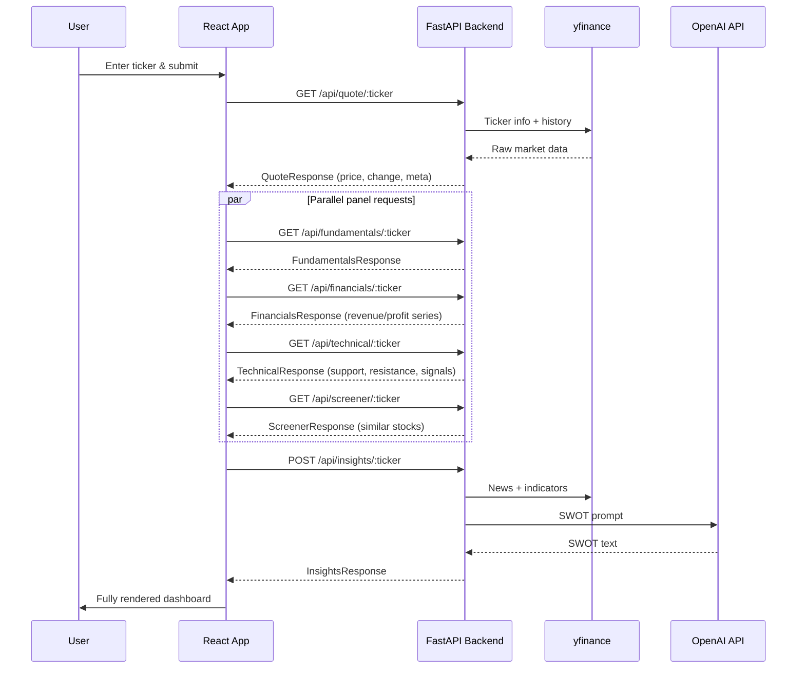
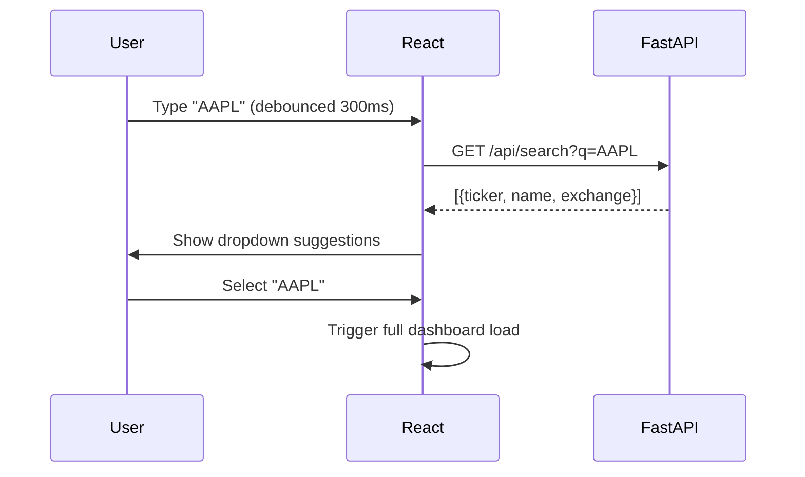

# Design Document: Stock Analysis Dashboard

## Overview

A full-stack stock analysis dashboard built with a React frontend and Python FastAPI backend. Users search for any stock ticker and are presented with a rich set of panels: financial fundamentals, revenue/profit charts, AI-generated SWOT analysis, technical support/resistance levels, trend signals, and a similar-stocks screener.

The backend acts as an aggregation layer — fetching data from `yfinance` and the OpenAI API, processing it, and serving clean JSON to the React UI. The frontend is a single-page application composed of independent panel components that request data concurrently and render progressively.

---

## Architecture



---

## Sequence Diagrams

### Main Dashboard Load Flow



### Stock Search Autocomplete Flow



---

## Components and Interfaces

### Frontend Components

#### `StockSearch`
**Purpose**: Autocomplete search input for ticker selection.

**Interface**:
```typescript
interface StockSearchProps {
  onSelect: (ticker: string) => void
}

interface SearchSuggestion {
  ticker: string
  name: string
  exchange: string
}
```

**Responsibilities**:
- Debounce user input (300ms) before calling search API
- Render dropdown with suggestions
- Emit selected ticker upward via `onSelect`

---

#### `FundamentalsPanel`
**Purpose**: Display key financial metrics in a card grid.

**Interface**:
```typescript
interface FundamentalsData {
  pe_ratio: number | null
  eps: number | null
  market_cap: number | null
  dividend_yield: number | null
  price_to_book: number | null
  debt_to_equity: number | null
  roe: number | null
  beta: number | null
  week_52_high: number | null
  week_52_low: number | null
}
```

**Responsibilities**:
- Render metric cards with formatted values and labels
- Show skeleton loaders while fetching
- Handle null values gracefully with "N/A"

---

#### `ProfitRevenuePanel`
**Purpose**: Bar/line charts for quarterly and annual revenue & net income.

**Interface**:
```typescript
interface FinancialSeries {
  period: string      // e.g. "Q1 2024", "FY 2023"
  revenue: number
  net_income: number
  gross_profit: number
}

interface FinancialsData {
  annual: FinancialSeries[]
  quarterly: FinancialSeries[]
}
```

**Responsibilities**:
- Toggle between Annual / Quarterly view
- Render grouped bar chart (Recharts `ComposedChart`)
- Format Y-axis values as currency (B/M suffix)

---

#### `AIInsightsPanel`
**Purpose**: Display AI-generated SWOT analysis.

**Interface**:
```typescript
interface SWOTInsights {
  strengths: string[]
  weaknesses: string[]
  opportunities: string[]
  threats: string[]
  summary: string
  generated_at: string   // ISO timestamp
}
```

**Responsibilities**:
- Trigger POST to insights endpoint on ticker selection
- Show loading spinner with "Analyzing..." message
- Render SWOT in a 2×2 card grid with icons
- Display generation timestamp

---

#### `TechnicalPanel`
**Purpose**: Price chart annotated with support/resistance levels.

**Interface**:
```typescript
interface PriceLevel {
  price: number
  strength: "strong" | "moderate" | "weak"
  type: "support" | "resistance"
}

interface TechnicalData {
  price_history: { date: string; close: number; volume: number }[]
  support_levels: PriceLevel[]
  resistance_levels: PriceLevel[]
  current_price: number
}
```

**Responsibilities**:
- Render candlestick-style or line chart with Recharts
- Draw horizontal reference lines for each support/resistance level
- Color-code by strength and type

---

#### `TrendPanel`
**Purpose**: Show short-term and long-term trend signals and indicators.

**Interface**:
```typescript
interface TrendSignal {
  indicator: string     // e.g. "RSI", "MACD", "SMA_50_200_Cross"
  value: number | string
  signal: "bullish" | "bearish" | "neutral"
  timeframe: "short" | "long"
}

interface TrendData {
  signals: TrendSignal[]
  short_term_bias: "bullish" | "bearish" | "neutral"
  long_term_bias: "bullish" | "bearish" | "neutral"
  price_history: { date: string; close: number; sma_50: number; sma_200: number }[]
}
```

**Responsibilities**:
- Render price chart with SMA-50 and SMA-200 overlaid
- Show indicator cards with colored badges per signal
- Display overall bias summary

---

#### `ScreenerPanel`
**Purpose**: Table of similar stocks based on sector, market cap, and fundamentals.

**Interface**:
```typescript
interface SimilarStock {
  ticker: string
  name: string
  sector: string
  market_cap: number
  pe_ratio: number | null
  price_change_1y: number | null
  similarity_score: number   // 0-1
}
```

**Responsibilities**:
- Render sortable table
- Allow clicking a row to load that ticker in the dashboard
- Show similarity score as a progress bar

---

### Backend API Modules

#### `routers/search.py`
```python
@router.get("/api/search")
async def search_tickers(q: str) -> list[SearchSuggestion]:
    ...
```

#### `routers/market.py`
```python
@router.get("/api/quote/{ticker}")
async def get_quote(ticker: str) -> QuoteResponse: ...

@router.get("/api/fundamentals/{ticker}")
async def get_fundamentals(ticker: str) -> FundamentalsResponse: ...

@router.get("/api/financials/{ticker}")
async def get_financials(ticker: str) -> FinancialsResponse: ...

@router.get("/api/technical/{ticker}")
async def get_technical(ticker: str) -> TechnicalResponse: ...

@router.get("/api/screener/{ticker}")
async def get_similar(ticker: str) -> ScreenerResponse: ...
```

#### `routers/insights.py`
```python
@router.post("/api/insights/{ticker}")
async def generate_insights(ticker: str) -> InsightsResponse: ...
```

---

## Data Models

### Backend Pydantic Models

```python
class QuoteResponse(BaseModel):
    ticker: str
    name: str
    exchange: str
    currency: str
    current_price: float
    change: float
    change_pct: float
    volume: int
    avg_volume: int
    market_status: str   # "open" | "closed" | "pre" | "after"

class FundamentalsResponse(BaseModel):
    ticker: str
    pe_ratio: float | None
    eps: float | None
    market_cap: int | None
    dividend_yield: float | None
    price_to_book: float | None
    debt_to_equity: float | None
    roe: float | None
    beta: float | None
    week_52_high: float | None
    week_52_low: float | None

class FinancialPeriod(BaseModel):
    period: str
    revenue: float
    net_income: float
    gross_profit: float

class FinancialsResponse(BaseModel):
    ticker: str
    annual: list[FinancialPeriod]
    quarterly: list[FinancialPeriod]

class PriceLevel(BaseModel):
    price: float
    strength: Literal["strong", "moderate", "weak"]
    type: Literal["support", "resistance"]

class TechnicalResponse(BaseModel):
    ticker: str
    current_price: float
    price_history: list[dict]   # {date, close, volume}
    support_levels: list[PriceLevel]
    resistance_levels: list[PriceLevel]

class TrendSignal(BaseModel):
    indicator: str
    value: float | str
    signal: Literal["bullish", "bearish", "neutral"]
    timeframe: Literal["short", "long"]

class TrendResponse(BaseModel):
    ticker: str
    short_term_bias: Literal["bullish", "bearish", "neutral"]
    long_term_bias: Literal["bullish", "bearish", "neutral"]
    signals: list[TrendSignal]
    price_history: list[dict]  # {date, close, sma_50, sma_200}

class SimilarStock(BaseModel):
    ticker: str
    name: str
    sector: str
    market_cap: int
    pe_ratio: float | None
    price_change_1y: float | None
    similarity_score: float

class ScreenerResponse(BaseModel):
    ticker: str
    similar: list[SimilarStock]

class SWOTInsights(BaseModel):
    strengths: list[str]
    weaknesses: list[str]
    opportunities: list[str]
    threats: list[str]
    summary: str
    generated_at: str

class InsightsResponse(BaseModel):
    ticker: str
    insights: SWOTInsights
```

**Validation Rules**:
- `ticker` must be 1–5 uppercase alphanumeric characters
- All price/financial values must be finite floats if not None
- `similarity_score` is clamped to [0.0, 1.0]
- `period` strings follow format `"Q[1-4] YYYY"` or `"FY YYYY"`

---

## Algorithmic Pseudocode

### Support & Resistance Detection Algorithm

```python
ALGORITHM compute_support_resistance(price_history, window=20, min_touches=2)
INPUT: price_history — list of OHLCV dicts, sorted ascending by date
       window        — lookback window for local extrema detection
       min_touches   — minimum touches to qualify a level
OUTPUT: support_levels, resistance_levels — list of PriceLevel

BEGIN
  ASSERT len(price_history) >= window * 2

  closes = [p["close"] for p in price_history]
  levels = []

  # Step 1: Find local minima (support candidates) and maxima (resistance candidates)
  FOR i IN range(window, len(closes) - window) DO
    local_min = min(closes[i - window : i + window])
    local_max = max(closes[i - window : i + window])

    IF closes[i] == local_min THEN
      levels.append({"price": closes[i], "type": "support", "touches": 1})
    END IF
    IF closes[i] == local_max THEN
      levels.append({"price": closes[i], "type": "resistance", "touches": 1})
    END IF
  END FOR

  # Step 2: Cluster nearby levels (within 1% of each other)
  clustered = cluster_levels(levels, tolerance=0.01)

  # Step 3: Count touches and assign strength
  FOR level IN clustered DO
    level.touches = count_touches(closes, level.price, tolerance=0.005)
    IF level.touches >= 4 THEN
      level.strength = "strong"
    ELSE IF level.touches >= 2 THEN
      level.strength = "moderate"
    ELSE
      level.strength = "weak"
    END IF
  END FOR

  # Step 4: Filter by minimum touches
  result = [l for l in clustered if l.touches >= min_touches]

  ASSERT all(l.price > 0 for l in result)
  RETURN result
END
```

**Preconditions:**
- `price_history` has at least `2 * window` data points
- All close prices are positive finite floats

**Postconditions:**
- Every returned level has `price > 0` and valid `strength` and `type`
- Levels are sorted by price ascending

**Loop Invariant:**
- At each iteration `i`, all indices `[0..i-1]` have been evaluated for local extrema

---

### SWOT Generation Algorithm

```python
ALGORITHM generate_swot(ticker, fundamentals, financials, news_headlines, technicals)
INPUT: ticker         — stock symbol string
       fundamentals   — FundamentalsResponse
       financials     — FinancialsResponse (last 4 quarters)
       news_headlines — list[str] (up to 10 recent headlines)
       technicals     — TechnicalResponse
OUTPUT: SWOTInsights

BEGIN
  # Step 1: Build structured context string
  context = format_prompt_context(
    ticker, fundamentals, financials, news_headlines, technicals
  )

  # Step 2: Build system + user prompt
  system_prompt = "You are a professional equity analyst. Provide a structured SWOT analysis."
  user_prompt = f"""
    Analyze {ticker} based on the following data:
    {context}

    Return a JSON object with keys:
    strengths, weaknesses, opportunities, threats (each a list of strings), and summary.
  """

  # Step 3: Call OpenAI API with structured output
  response = openai.chat.completions.create(
    model="gpt-4o-mini",
    messages=[
      {"role": "system", "content": system_prompt},
      {"role": "user", "content": user_prompt}
    ],
    response_format={"type": "json_object"},
    temperature=0.4
  )

  # Step 4: Parse and validate response
  raw = json.loads(response.choices[0].message.content)

  ASSERT all(k in raw for k in ["strengths", "weaknesses", "opportunities", "threats", "summary"])

  RETURN SWOTInsights(
    strengths=raw["strengths"],
    weaknesses=raw["weaknesses"],
    opportunities=raw["opportunities"],
    threats=raw["threats"],
    summary=raw["summary"],
    generated_at=datetime.utcnow().isoformat()
  )
END
```

**Preconditions:**
- `ticker` is a valid, non-empty stock symbol
- At least one of fundamentals, financials, or news is non-empty
- OpenAI API key is configured in environment

**Postconditions:**
- Returned `SWOTInsights` has non-empty lists for all four SWOT quadrants
- `generated_at` is a valid ISO 8601 UTC timestamp

---

### Similar Stocks Screener Algorithm

```python
ALGORITHM find_similar_stocks(target_ticker, universe_size=100)
INPUT: target_ticker — stock symbol
OUTPUT: list[SimilarStock] sorted by similarity_score descending

BEGIN
  # Step 1: Fetch target stock profile
  target = fetch_fundamentals(target_ticker)
  ASSERT target is not None

  # Step 2: Get sector peers from yfinance or a predefined sector map
  peers = get_sector_peers(target.sector, limit=universe_size)

  # Step 3: Fetch fundamentals for each peer (in parallel)
  peer_data = await asyncio.gather(*[fetch_fundamentals(p) for p in peers])

  # Step 4: Compute similarity score using weighted Euclidean distance
  scores = []
  FOR peer IN peer_data DO
    IF peer is None THEN CONTINUE END IF

    features_target = normalize([target.pe_ratio, target.market_cap, target.beta, target.roe])
    features_peer   = normalize([peer.pe_ratio, peer.market_cap, peer.beta, peer.roe])

    distance = euclidean_distance(features_target, features_peer)
    score = 1 / (1 + distance)   # transform to [0, 1] similarity

    scores.append(SimilarStock(
      ticker=peer.ticker,
      name=peer.name,
      sector=peer.sector,
      market_cap=peer.market_cap,
      pe_ratio=peer.pe_ratio,
      price_change_1y=peer.price_change_1y,
      similarity_score=round(score, 4)
    ))
  END FOR

  # Step 5: Sort, exclude the target itself, return top 10
  result = sorted(scores, key=lambda s: s.similarity_score, reverse=True)
  result = [s for s in result if s.ticker != target_ticker][:10]

  ASSERT all(0 <= s.similarity_score <= 1 for s in result)
  RETURN result
END
```

**Preconditions:**
- `target_ticker` resolves to a valid stock with sector data
- `universe_size` ≥ 10

**Postconditions:**
- Returns at most 10 results, not including the target ticker
- All `similarity_score` values are in [0.0, 1.0]
- Results are sorted by `similarity_score` descending

---

## Key Functions with Formal Specifications

### `fetch_fundamentals(ticker: str) -> FundamentalsResponse`

**Preconditions:**
- `ticker` matches `^[A-Z]{1,5}$`
- `yfinance` is available and has network access

**Postconditions:**
- Returns a `FundamentalsResponse` with all fields populated (or None for unavailable metrics)
- Raises `HTTPException(404)` if ticker not found

---

### `compute_trend_signals(price_history: list[dict]) -> TrendResponse`

**Preconditions:**
- `price_history` contains at least 200 data points (for SMA-200)
- Each entry has `date`, `close`, `volume`

**Postconditions:**
- `sma_50` and `sma_200` computed for all valid indices
- `short_term_bias` derived from RSI + MACD
- `long_term_bias` derived from SMA-50 vs SMA-200 crossover

**Loop Invariant:**
- At index `i`, all SMAs for indices `[0..i-1]` are correctly computed

---

### `useStockData(ticker: string)` — React custom hook

```typescript
function useStockData(ticker: string): {
  quote: QuoteResponse | null
  fundamentals: FundamentalsData | null
  financials: FinancialsData | null
  technical: TechnicalData | null
  trend: TrendData | null
  screener: SimilarStock[] | null
  loading: Record<string, boolean>
  errors: Record<string, string | null>
}
```

**Preconditions:**
- `ticker` is a non-empty string
- API base URL is configured

**Postconditions:**
- All fetch calls are initiated concurrently via `Promise.all`
- Individual panel loading/error states are independent
- Stale data from previous ticker is cleared on new `ticker` value

---

## Example Usage

### Frontend — Load Dashboard

```typescript
// App.tsx
const [ticker, setTicker] = useState<string>("")
const { quote, fundamentals, financials, technical, trend, screener, loading, errors } = useStockData(ticker)

return (
  <div className="dashboard">
    <StockSearch onSelect={setTicker} />
    {ticker && (
      <>
        <QuoteHeader data={quote} loading={loading.quote} />
        <FundamentalsPanel data={fundamentals} loading={loading.fundamentals} />
        <ProfitRevenuePanel data={financials} loading={loading.financials} />
        <TechnicalPanel data={technical} loading={loading.technical} />
        <TrendPanel data={trend} loading={loading.trend} />
        <ScreenerPanel data={screener} onSelect={setTicker} loading={loading.screener} />
        <AIInsightsPanel ticker={ticker} />
      </>
    )}
  </div>
)
```

### Backend — Quote Endpoint

```python
# routers/market.py
@router.get("/api/quote/{ticker}")
async def get_quote(ticker: str) -> QuoteResponse:
    ticker = ticker.upper().strip()
    if not re.match(r"^[A-Z]{1,5}$", ticker):
        raise HTTPException(status_code=422, detail="Invalid ticker format")

    cached = cache.get(f"quote:{ticker}")
    if cached:
        return cached

    stock = yf.Ticker(ticker)
    info = stock.info
    if not info or "currentPrice" not in info:
        raise HTTPException(status_code=404, detail=f"Ticker {ticker} not found")

    result = QuoteResponse(
        ticker=ticker,
        name=info.get("longName", ticker),
        exchange=info.get("exchange", ""),
        currency=info.get("currency", "USD"),
        current_price=info["currentPrice"],
        change=info.get("regularMarketChange", 0.0),
        change_pct=info.get("regularMarketChangePercent", 0.0),
        volume=info.get("volume", 0),
        avg_volume=info.get("averageVolume", 0),
        market_status="open"
    )
    cache.set(f"quote:{ticker}", result, ttl=60)
    return result
```

---

## Correctness Properties

### Property 1: Quote Resolution
∀ ticker t: `get_quote(t)` either returns a valid `QuoteResponse` or raises `HTTP 404` — never returns a partial or malformed response.

### Property 2: Price Level Validity
∀ `PriceLevel` l returned by `compute_support_resistance`: `l.price > 0 ∧ l.strength ∈ {strong, moderate, weak} ∧ l.type ∈ {support, resistance}`.

### Property 3: Similarity Score Bounds
∀ `SimilarStock` s returned by `find_similar_stocks`: `0.0 ≤ s.similarity_score ≤ 1.0`, and the target ticker itself is excluded from results.

### Property 4: SWOT Completeness
∀ `SWOTInsights` i returned by `generate_swot`: all four SWOT lists (`strengths`, `weaknesses`, `opportunities`, `threats`) are non-empty, and `summary` is a non-empty string.

### Property 5: Financial Period Format
∀ financial period p in `FinancialsResponse`: `p.revenue ≥ 0 ∧ p.period` matches `Q[1-4] YYYY` or `FY YYYY`.

### Property 6: Panel Independence
Concurrent panel API requests are independent — an error or timeout in one panel endpoint does not propagate to or block any other panel.

### Property 7: Stale State Clearing
`useStockData` clears all panel data from the previous ticker before new results arrive, ensuring no cross-ticker data leakage in the UI.

---

## Error Handling

### Invalid Ticker
- **Condition**: User enters a ticker that yfinance cannot resolve
- **Response**: Backend returns `HTTP 404`; frontend shows inline error message in affected panels
- **Recovery**: User can enter a different ticker; no app crash

### External API Failure (yfinance / OpenAI)
- **Condition**: yfinance rate-limit, network timeout, or OpenAI API error
- **Response**: Backend returns `HTTP 503` with `{"detail": "Data provider unavailable"}`
- **Recovery**: Frontend displays retry button per panel; exponential backoff on retries

### AI Insights Timeout
- **Condition**: OpenAI call exceeds 30s timeout
- **Response**: Return partial response or `HTTP 504`; frontend shows "AI analysis unavailable" message
- **Recovery**: User can manually retry the AI panel independently

### Missing Metrics
- **Condition**: Some fundamentals fields are not available for the ticker (e.g. ETFs lack P/E)
- **Response**: Field is `null` in response
- **Recovery**: Frontend renders "N/A" — no error state needed

---

## Testing Strategy

### Unit Testing

- **Backend**: `pytest` for all service functions; mock `yfinance` and `openai` calls
- **Frontend**: `vitest` + `@testing-library/react` for all panel components
- Key cases: invalid ticker handling, null metric rendering, chart rendering with empty data

### Property-Based Testing

- **Library**: `hypothesis` (Python backend), `fast-check` (TypeScript frontend)
- Properties to test:
  - `compute_support_resistance` always returns levels with `price > 0`
  - `find_similar_stocks` always returns `similarity_score ∈ [0, 1]`
  - `normalize()` always returns vectors of unit length
  - Any valid ticker string produces a valid `QuoteResponse` or a defined error

### Integration Testing

- End-to-end: search → load dashboard → verify all 6 panels render data
- Mock external APIs at the HTTP boundary using `respx` (Python) and `msw` (frontend)

---

## Performance Considerations

- **Caching**: Cache yfinance responses in-memory (or Redis) with TTL: 60s for quotes, 24h for financials/fundamentals
- **Parallel Fetching**: Frontend fires all panel API calls concurrently; backend uses `asyncio.gather` for multi-ticker screener
- **Progressive Rendering**: Each panel renders independently as data arrives — no blocking wait for all panels
- **AI Insights**: Generated on demand (user-triggered), not on page load, to avoid unnecessary OpenAI costs

---

## Security Considerations

- **API Key Protection**: `OPENAI_API_KEY` and any paid data provider keys stored in environment variables only, never in frontend
- **Input Validation**: All ticker inputs validated with regex `^[A-Z]{1,5}$` before hitting external APIs
- **CORS**: FastAPI CORS middleware restricted to frontend origin only in production
- **Rate Limiting**: Apply `slowapi` rate limiting on `/api/insights` (expensive endpoint) — 10 req/min per IP

---

## Dependencies

### Frontend
| Package | Purpose |
|---|---|
| `react` + `typescript` | UI framework |
| `recharts` | Charts (bar, line, reference lines) |
| `axios` or `fetch` | HTTP client |
| `tailwindcss` | Styling |
| `react-query` | Data fetching + caching + loading states |

### Backend
| Package | Purpose |
|---|---|
| `fastapi` | API framework |
| `uvicorn` | ASGI server |
| `yfinance` | Market data (free) |
| `openai` | AI SWOT generation |
| `pydantic` | Data validation |
| `pandas` + `numpy` | Financial calculations, SMA, RSI |
| `slowapi` | Rate limiting |
| `pytest` + `hypothesis` | Testing |
